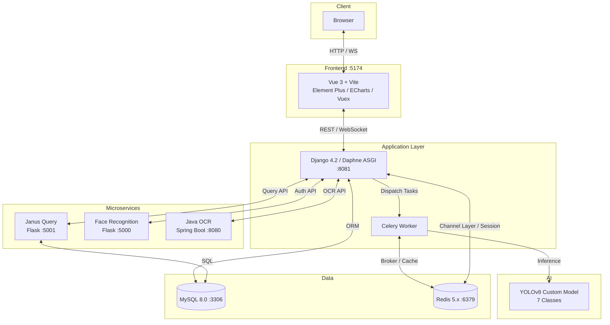
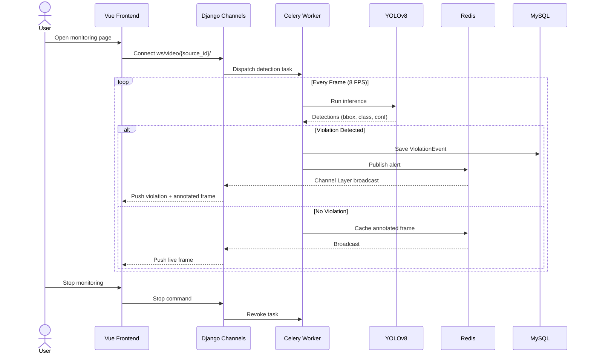
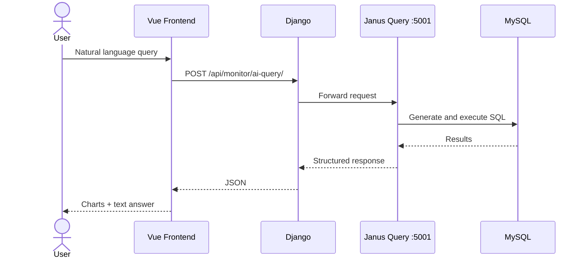

# Catering Environment Behavior Detection System

[](https://opensource.org/licenses/MIT)
[](https://www.python.org/)
[](https://nodejs.org/)
[](https://www.djangoproject.com/)
[](https://vuejs.org/)

> A real-time catering kitchen monitoring system powered by YOLOv8 object detection, integrating video stream analysis, violation event management, AI-powered querying, and multi-role access control.

---

## Core Features

- **Real-Time Video Monitoring** — Live PPE compliance checks (mask, hat, uniform) and prohibited item detection (phone, cigarette, mouse) via YOLOv8
- **ROI Configuration** — Custom polygon-based detection regions
- **Violation Management** — Auto snapshot, confirmation, false alarm marking, batch upload, and export
- **Analytics Dashboard** — Trend charts, camera comparisons, and hourly distribution (ECharts)
- **AI Natural Language Query** — Query violation data in plain language (Janus/Flask)
- **Multi-Role Auth** — Admin / Manager / Visitor with email verification and security questions
- **Face Recognition Login** — Optional face-based authentication
- **Enterprise OCR** — ID card and business license recognition (Java Spring Boot)
- **WebRTC Data Sharing** — P2P file sharing between Manager and Visitor
- **Token Access Control** — Admin-managed access tokens for controlled data sharing

---

## Architecture

### System Components



### Real-Time Detection Flow



### AI Query Flow



### YOLO Detection Classes

| Class | Logic |
|---|---|
| `person` | Baseline for PPE checks |
| `mask` `hat` `uniform` | Not on person → violation |
| `mouse` `phone` `cigarette` | Presence → violation |

---

## Quick Start

### Requirements

- **Node.js** >= 18 · **Python** >= 3.9 · **MySQL** >= 8.0 · **Redis** >= 5.0
- Optional: **Java JRE** >= 8 (OCR) · **CUDA** (GPU acceleration)

### 1. Database

```sql
CREATE DATABASE kitchen_detection_system CHARACTER SET utf8mb4 COLLATE utf8mb4_0900_ai_ci;
USE kitchen_detection_system;
SOURCE backend/kitchen_detection_system.sql;
```

### 2. Backend

```bash
cd backend
python -m venv venv && venv\Scripts\activate   # Windows
pip install -r requirements.txt
cp .env.example .env                           # Edit with your credentials
python manage.py migrate
python start_all_services.py                   # One-click launch
```

This starts **Redis → Java OCR → Django (Daphne :8081) → Janus (:5001) → Face Service (:5000) → Celery Worker** in sequence.

### 3. Frontend

```bash
cd frontend
npm install
npm run dev   # http://localhost:5174
```

### Key Environment Variables (`backend/.env`)

| Variable | Required | Default |
|---|---|---|
| `DJANGO_SECRET_KEY` | Yes | — |
| `DB_PASSWORD` | Yes | — |
| `DB_NAME` / `DB_USER` / `DB_HOST` / `DB_PORT` | | `kitchen_detection_system` / `root` / `127.0.0.1` / `3306` |
| `REDIS_HOST` / `REDIS_PORT` | | `127.0.0.1` / `6379` |
| `PYTHON_APP_PORT` | | `8081` |
| `YOLO_DEVICE` | | `cpu` |

---

## Project Structure

```
├── frontend/                         # Vue 3 + Vite
│   ├── src/components/               # UI components (login, monitor, permissions...)
│   ├── src/views/                    # Page views
│   ├── src/services/                 # API layer & WebRTC clients
│   ├── store/                        # Vuex modules
│   └── vite.config.js                # Dev proxy config
│
├── backend/                          # Django 4.2
│   ├── core/                         # Settings, URLs, ASGI, Celery
│   ├── apps/monitor/                 # Violations, AI query, permissions, WebRTC
│   ├── apps/login/                   # Auth, user API, face recognition
│   ├── detection/                    # YOLO module (model, consumers, tasks)
│   │   └── yolo/weights/best.pt      # Custom YOLOv8 weights
│   ├── face_service/                 # Face recognition (Flask)
│   ├── janus_query_service.py        # AI query service (Flask)
│   ├── lib/                          # Java OCR JAR
│   ├── start_all_services.py         # One-click launcher
│   ├── kitchen_detection_system.sql  # DB init script
│   ├── requirements.txt
│   └── .env.example                  # Env template
│
├── .gitignore
├── LICENSE
└── README.md
```

---

## License

[MIT License](LICENSE). Third-party: [Ultralytics YOLOv8](https://github.com/ultralytics/ultralytics) (AGPL-3.0), [PyTorch](https://github.com/pytorch/pytorch) (BSD-3-Clause).
